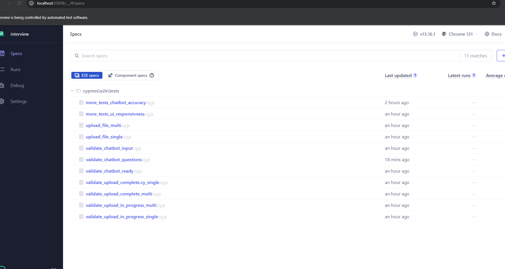
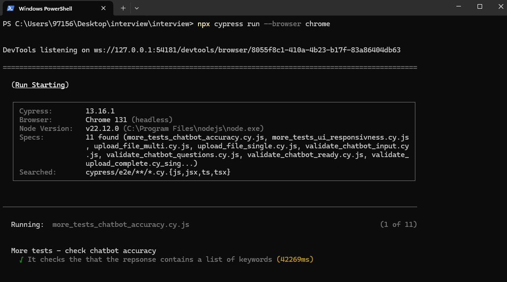
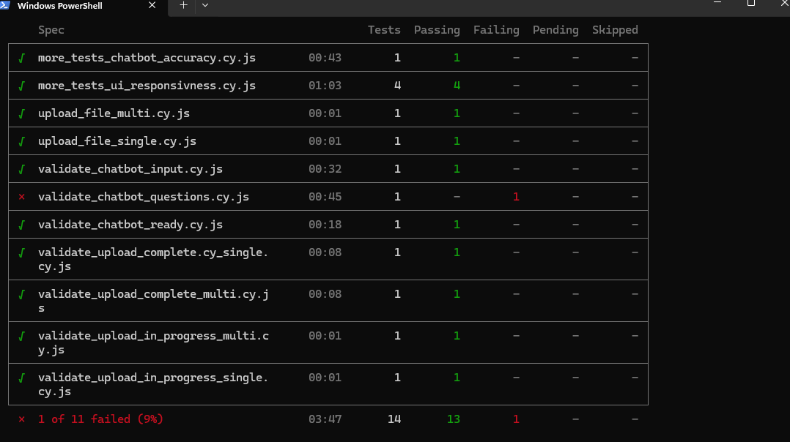
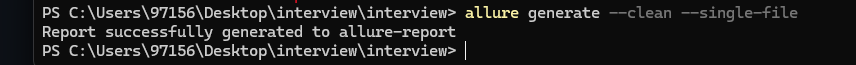
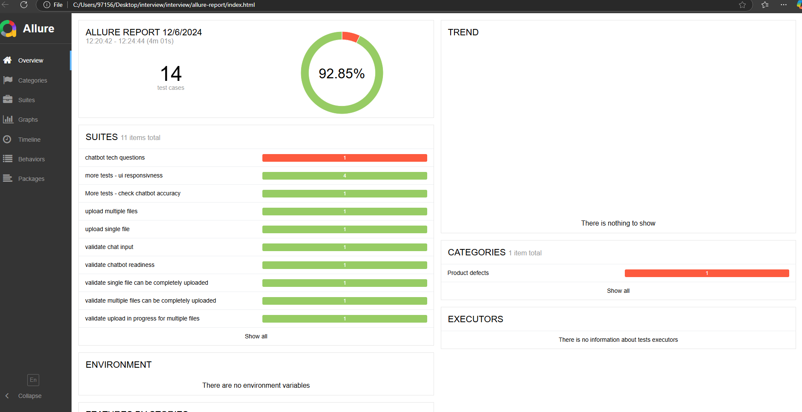

# Interview test - Sahil Mohmed

## To-do (not enough time)
1. run Cypress and Allure as docker services
2. integrate Cypress and Allure docker services into the challenge docker container - by adding the services into the docker-compose 
3. configure docker-compose to run the tests as soon as 'front' service is created (depends_on: 'front')
4. configure Allure service to auto generate a html report once the tests have finished running

## Advantages
1. can be easily integrated into a Jenkins pipeline with stages (docker compose -> cypress run -> Allure report)
2. all common methods have been abstracted and can be reused in new tests
3. All tests can be run individually (no test is dependant on another)
4. env variables json has been used, so each setup can have their own configuration 

## Disdvantages
1. initial setup can take some time as i didnt get time to integrate into docker

## How to run the tests
### Pre-requisites 
1. Cypress installed
2. Allure installed
3. JAVA_HOME set in system env (for Allure)
4. Run the DocumentGPT docker container by downloading the 'challenge.zip' extract it and run the following command in terminal 'docker compose -f "docker-compose.yml" up -d --build'
5. Ensure all docker services are running 'docker ps -a'
[!IMPORTANT]
OpenAI have recently removed the 'proxies' argument in Client.__init__ for the latest httpx. This will cause docker compose to fail. To fix this, add the following to requirements.txt 'httpx==0.27.2'

### Setup
1. clone repo
2. open terminal in the root of the repo

### Run in UI 
1. in the terminal - run 'npx cypress open'
2. select e2e
3. select test specs to run

### Run in cmd
1. in the terminal - run 'npx cypress run --browser chrome' this will run all the test specs

### generating a report
1. in terminal - run 'allure generate --clean --single-file'

2. navigate to root/allure-report
3. open the generated html file to view the report

